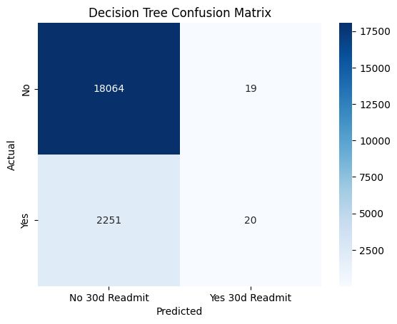
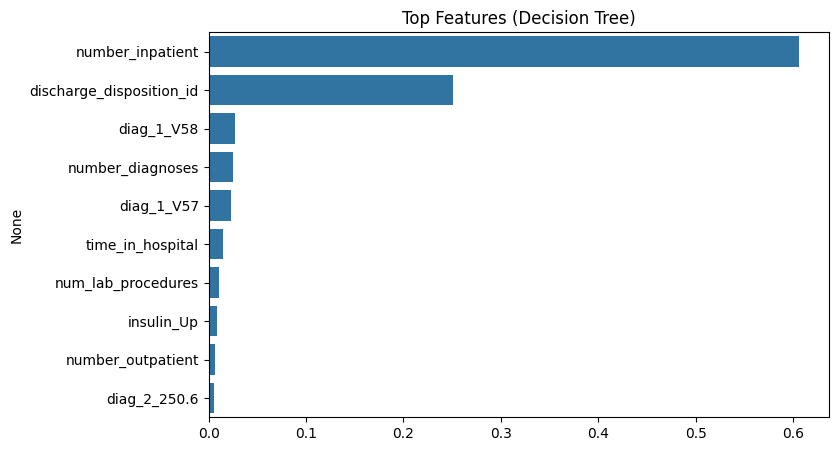

# Hospital Readmission Risk Analysis (Healthcare + Predictive Analytics)

**Python | Pandas | Scikit-learn | Matplotlib | Seaborn**

This project uses [UCI Diabetes 130-US hospitals dataset](https://archive.ics.uci.edu/ml/datasets/diabetes+130-us+hospitals+for+years+1999-2008) (~100,000 encounters) to predict **30-day hospital readmissions**.  

**Why it matters:** Hospitals face financial penalties from CMS for high readmission rates. Predicting high-risk patients helps allocate resources, improve patient outcomes, and reduce costs.

---

## Project Workflow

1. **Data Cleaning**
   - Dropped patient identifiers (`encounter_id`, `patient_nbr`)  
   - Converted `readmitted` column into a binary target (`<30 days` vs. not)  
   - Replaced `"?"` with `NaN` and imputed missing values  
   - One-hot encoded categorical features  
   - Saved a cleaned dataset for modeling  

2. **Modeling**
   - Logistic Regression (baseline, interpretable)  
   - Decision Tree Classifier (captures non-linear relationships)  
   - Evaluation metrics: Accuracy, Precision, Recall, F1, ROC-AUC  

3. **Evaluation**
   - Accuracy: ~88%  
   - Precision: ~50% (when predicting readmission)  
   - Recall: <2% (model struggled with class imbalance)  
   - Feature importance highlighted:  
     - **Prior inpatient visits**  
     - **Discharge disposition** (home vs. transfer)  
     - **Primary diagnoses** (chronic conditions)  
     - **Time in hospital**  

4. **Visuals**
   - Confusion Matrix (Decision Tree)  
   - Top 10 Feature Importance Bar Plot  

**Confusion Matrix (Decision Tree)**

**Top 10 Features by Importance**

  

---
## What I Learned
- How to clean and preprocess a large real-world healthcare dataset with missing values and categorical features. 
- The impact of **class imbalance** on predictive modeling (why recall can be low even if accuracy is high)  
- How to apply Logistic Regression and Decision Trees 
- The importance of communicating technical results in a **healthcare business context**
---

## Key Findings

- Models achieved high accuracy (~88%) but very low recall due to class imbalance.  
- **Prior inpatient visits** and **discharge status** were the strongest predictors of readmission risk.  
- Indicates hospitals should flag **patients with multiple hospitalizations and vulnerable discharge statuses** for extra care management.  

### What My Findings Show
- Patients with **multiple prior inpatient visits** and certain **discharge statuses** are at the highest risk of being readmitted within 30 days  
- **Time in hospital** and **chronic diagnoses** also contribute to higher readmission likelihood  
- Models had high overall accuracy (~88%), highlighting the challenge of predicting rare events in healthcare  
- These results suggest that hospitals should **prioritize care management for high-risk groups** to improve patient outcomes

---

## Repository Structure

hospital-readmission-risk-analysis/
├── data/
│   └── data.csv              
│
├── notebooks/
│   ├── clean.ipynb               # data cleaning & preprocessing
│   └── load.ipynb                # logistic regression & decision tree models
│
├── visuals/                      # saved plots (confusion matrix, feature importance)
│   ├── output.png
│   └── output2.png
│
├── requirements.txt             # dependencies
├── README.md                    # project overview
└── .gitignore                   # ignore venv, CSVs, checkpoints

